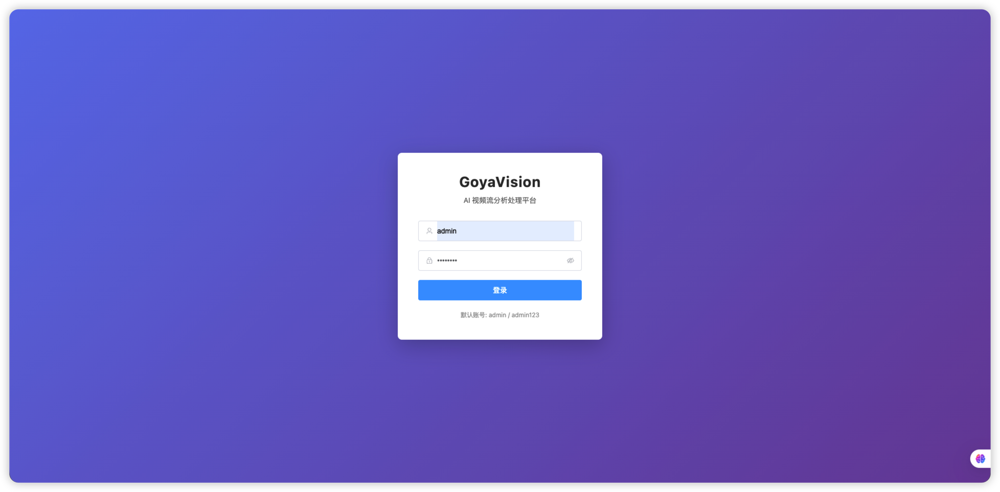
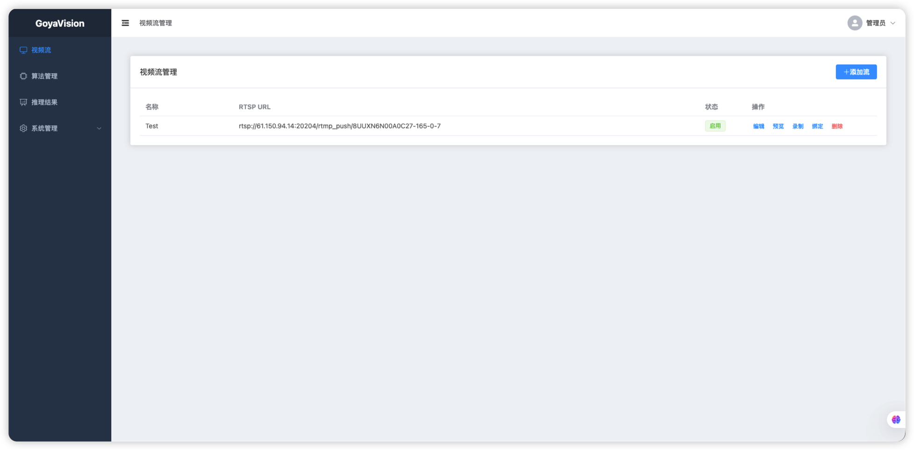
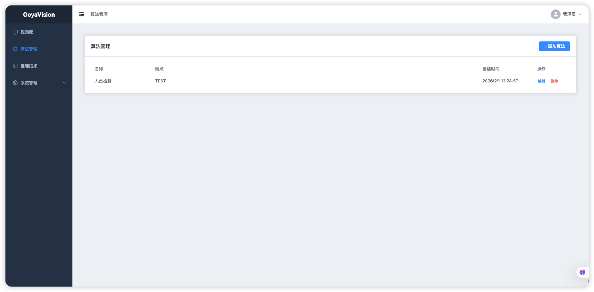
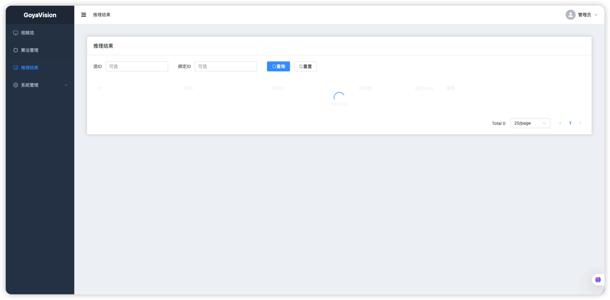
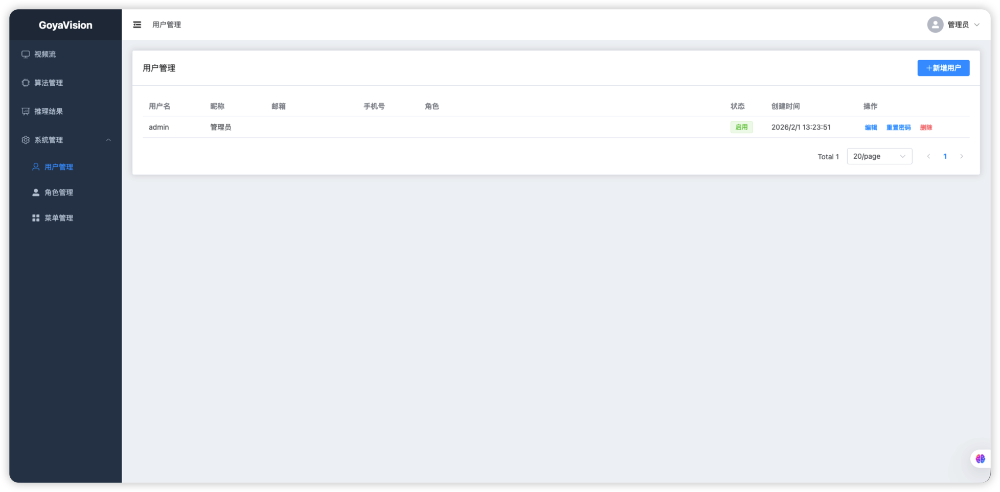
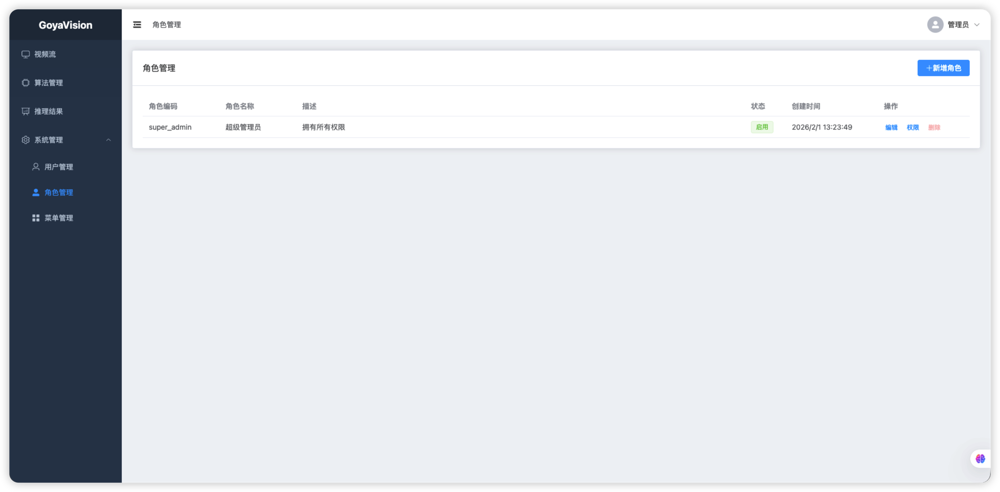
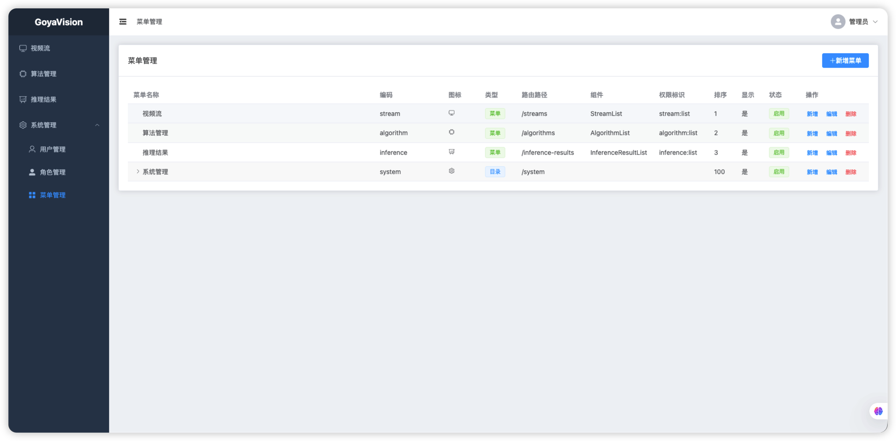

# GoyaVision

<div align="center">

**企业级 AI 视频流分析处理平台**

[](LICENSE)
[](https://golang.org/)
[](https://goreportcard.com/report/github.com/GoyaDo/GoyaVision)

[功能特性](#功能特性) • [快速开始](#快速开始) • [文档](#文档) • [贡献](#贡献) • [许可证](#许可证)

</div>

---

GoyaVision 是一个企业级、开源的 AI 视频流分析处理平台。支持 RTSP 流接入、智能抽帧、视频录制、AI 模型推理，以及灵活的算法调度策略。

## ✨ 功能特性

### 核心功能

- **🎥 视频流管理**
  - RTSP 流接入与多路并发支持（单实例 10+ 路）
  - 流的启停控制与状态管理
  - 实时流健康监控

- **🤖 AI 推理引擎**
  - 灵活的算法绑定机制（一流多算法）
  - 可配置的抽帧频率（`interval_sec`）
  - 定时调度（`schedule`）与延迟启动（`initial_delay_sec`）
  - HTTP + JSON 推理服务集成
  - 推理结果持久化与查询

- **📹 视频录制**
  - 独立于分析的录制功能
  - 按流启停控制
  - 分段落盘（可配置段时长）
  - 零重编码录制（`-c copy`）

- **👁️ 实时预览**
  - HLS 流式预览
  - MediaMTX 或 FFmpeg 支持
  - 低延迟视频播放

- **🖥️ Web 管理界面**
  - Vue 3 + TypeScript 现代化前端
  - 流管理、算法配置、录制控制
  - 推理结果可视化
  - 内嵌式部署（Go embed）

- **🔐 认证授权**
  - JWT Token 认证（Access Token + Refresh Token）
  - 基于 RBAC 的权限模型
  - 用户、角色、权限、菜单管理
  - 动态菜单与按钮级权限控制

### 企业级特性

- **🏗️ 分层架构**：清晰的领域驱动设计（DDD），易于维护与扩展
- **🔒 生产就绪**：健康检查、指标监控、结构化日志
- **⚡ 高性能**：进程池管理、资源限流、并发优化
- **🔧 灵活配置**：YAML 配置 + 环境变量覆盖
- **📦 单二进制部署**：Go + embed 前端，部署简单

## 📸 界面预览

### 登录页面

安全的用户认证，支持 JWT Token 登录。



### 视频流管理

管理 RTSP 视频流，支持启用/禁用、预览、录制和算法绑定。



### 算法管理

配置 AI 算法，定义推理服务端点和输入输出规范。



### 推理结果

查询和浏览 AI 推理结果，支持按流、时间范围过滤。



### 用户管理

管理系统用户，支持角色分配和状态控制。



### 角色管理

基于 RBAC 的角色权限管理，灵活配置菜单和操作权限。



### 菜单管理

动态菜单配置，支持目录、菜单、按钮三级权限控制。



## 🚀 快速开始

### 前置要求

- **Go** 1.22 或更高版本
- **PostgreSQL** 12+ 
- **FFmpeg**（PATH 或配置路径）
- **可选**：MediaMTX（用于预览功能）

### 安装

```bash
# 克隆仓库
git clone https://github.com/GoyaDo/GoyaVision.git
cd GoyaVision

# 安装依赖
go mod download

# 创建数据库
createdb goyavision
# 或使用 psql
psql -c "CREATE DATABASE goyavision;"
```

### 配置

编辑 `configs/config.yaml` 或使用环境变量：

```bash
# 数据库连接
export GOYAVISION_DB_DSN="host=localhost user=goyavision password=goyavision dbname=goyavision port=5432 sslmode=disable"

# 服务器端口
export GOYAVISION_SERVER_PORT=8080
```

### 运行

```bash
# 开发模式（仅后端）
go run ./cmd/server

# 构建完整项目（包含前端）
make build-all

# 或分别构建
make build-web  # 构建前端
make build      # 构建后端

# 运行
./bin/goyavision
```

服务将在 `http://localhost:8080` 启动：
- **Web 界面**：`http://localhost:8080/`
- **API 前缀**：`/api/v1`
- **HLS 文件**：`/live/*`

### Docker（规划中）

```bash
# 即将支持
docker-compose up
```

## 📚 文档

### 核心文档

- [需求文档](docs/requirements.md) - 功能需求与范围定义
- [开发进度](docs/development-progress.md) - 项目开发状态与路线图
- [架构文档](docs/architecture.md) - 系统架构设计说明
- [API 文档](docs/api.md) - RESTful API 接口文档
- [部署指南](docs/DEPLOYMENT.md) - 部署和运维指南
- [贡献指南](CONTRIBUTING.md) - 如何参与项目贡献
- [安全策略](SECURITY.md) - 安全漏洞报告流程
- [变更日志](CHANGELOG.md) - 版本更新记录

### API 端点概览

| 资源            | 方法 | 路径 |
|-----------------|------|------|
| Auth            | POST | `/api/v1/auth/login`, `/refresh`, `/logout` |
| Auth            | GET/PUT | `/api/v1/auth/profile`, `/password` |
| Stream          | CRUD | `/api/v1/streams` |
| Algorithm       | CRUD | `/api/v1/algorithms` |
| AlgorithmBinding| CRUD | `/api/v1/streams/:id/algorithm-bindings` |
| Record          | POST | `/api/v1/streams/:id/record/start`, `/stop` |
| Record          | GET  | `/api/v1/streams/:id/record/sessions` |
| InferenceResult | GET  | `/api/v1/inference_results`（支持过滤和分页） |
| Preview         | GET  | `/api/v1/streams/:id/preview/start` |
| Preview         | POST | `/api/v1/streams/:id/preview/stop` |
| User            | CRUD | `/api/v1/users` |
| Role            | CRUD | `/api/v1/roles` |
| Menu            | CRUD | `/api/v1/menus` |
| Permission      | GET  | `/api/v1/permissions` |

详细 API 文档见 [API 文档](docs/api.md)。

## 🏗️ 技术架构

### 技术栈

| 类别     | 选型                          |
|----------|-------------------------------|
| 后端     | Go 1.22, Echo v4, Viper, GORM |
| 数据库   | PostgreSQL                    |
| 调度     | gocron v2                     |
| 视频处理 | FFmpeg CLI, MediaMTX          |
| 前端     | Vue 3, TypeScript, Vite, Element Plus, video.js |

### 项目结构

```
goyavision/
├── cmd/server/          # 应用入口
├── config/              # 配置管理
├── configs/             # 配置文件
├── internal/
│   ├── domain/          # 领域实体（纯业务逻辑）
│   ├── port/            # 端口接口定义
│   ├── app/             # 应用服务（用例编排）
│   ├── adapter/         # 适配器实现（persistence、ffmpeg、preview、ai）
│   └── api/             # HTTP 层（路由、handler、dto）
├── pkg/
│   ├── ffmpeg/          # FFmpeg 进程池和管理器
│   └── preview/         # 预览池和管理器
├── web/                 # Vue 3 前端（TypeScript + Vite）
│   ├── src/             # 源代码
│   └── dist/            # 构建产物（会被 embed）
├── migrations/          # 数据库迁移
└── docs/                # 项目文档
```

### 架构设计

GoyaVision 采用分层架构（Clean Architecture / Hexagonal Architecture）：

- **Domain Layer**: 核心业务实体与逻辑，无外部依赖
- **Port Layer**: 接口定义，定义应用边界
- **App Layer**: 用例编排，协调 domain 与 port
- **Adapter Layer**: 基础设施实现（数据库、FFmpeg、AI 服务等）
- **API Layer**: HTTP 接口层，处理请求与响应

详细架构说明见 [架构文档](docs/architecture.md)。API 使用说明见 [API 文档](docs/api.md)。

## 🤝 贡献

我们欢迎所有形式的贡献！请查看 [贡献指南](CONTRIBUTING.md) 了解如何参与。

### 贡献方式

- 🐛 [报告 Bug](https://github.com/GoyaDo/GoyaVision/issues/new?template=bug_report.md)
- 💡 [提出功能建议](https://github.com/GoyaDo/GoyaVision/issues/new?template=feature_request.md)
- 📝 [改进文档](CONTRIBUTING.md#文档贡献)
- 💻 [提交代码](CONTRIBUTING.md#提交代码)

### 行为准则

请遵循我们的 [行为准则](CODE_OF_CONDUCT.md)，保持社区友好和包容。

## 🔒 安全

如果您发现了安全漏洞，请查看 [安全策略](SECURITY.md) 了解如何报告。

**请勿**在公开 Issue 中报告安全问题。

## 📄 许可证

本项目采用 [Apache License 2.0](LICENSE) 许可证。

## 👤 作者

**Goya**

- 网站: [www.ysmjjsy.com](https://www.ysmjjsy.com)
- 邮箱: chenjie@ysmjjsy.com

## 🙏 致谢

感谢所有为 GoyaVision 做出贡献的开发者和用户！

## 📞 联系方式

- **Issues**: [GitHub Issues](https://github.com/GoyaDo/GoyaVision/issues)
- **讨论**: [GitHub Discussions](https://github.com/GoyaDo/GoyaVision/discussions)（规划中）
- **安全**: 见 [SECURITY.md](SECURITY.md)
- **网站**: [www.ysmjjsy.com](https://www.ysmjjsy.com)

---

<div align="center">

**GoyaVision** - 让 AI 视频分析更简单、更强大

[⭐ Star us on GitHub](https://github.com/GoyaDo/GoyaVision) • [📖 阅读文档](docs/requirements.md) • [🤝 参与贡献](CONTRIBUTING.md)

</div>
