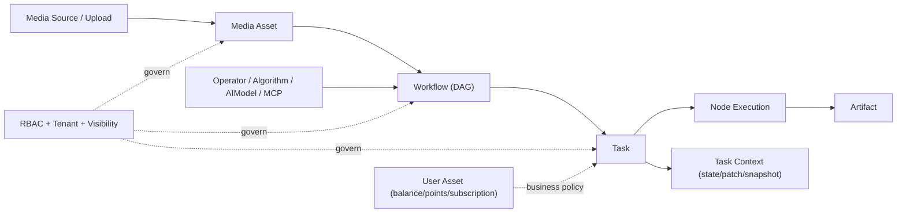
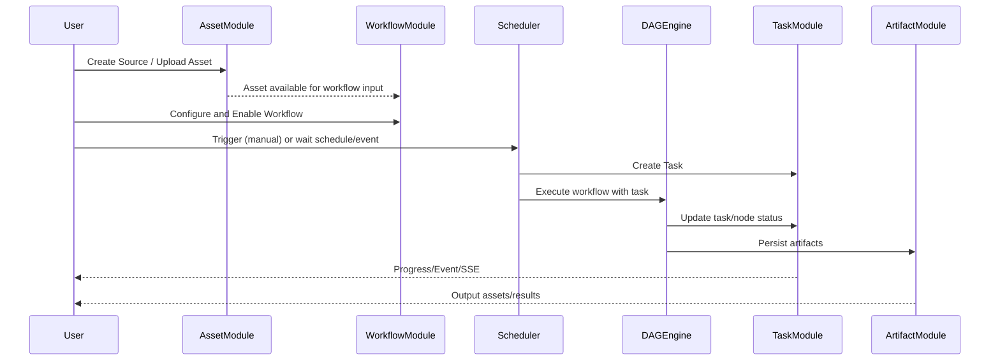

# GoyaVision 业务架构与业务流转（现状梳理）

## 1. 文档目的

本文件用于统一回答以下问题：

- 当前项目的业务架构是什么。
- 各模块分别解决什么问题。
- 模块之间如何协作与依赖。
- 关键业务流程如何流转。
- 当前业务链路哪里闭环、哪里断点。

适用范围：2026-02-08 当前代码实现。

## 2. 业务定位与核心命题

GoyaVision 的核心命题不是“单点算法调用”，而是：

- 以媒体资产为中心管理全生命周期。
- 以算子/算法/模型为可编排能力单元。
- 以工作流与任务实现自动化执行与可观测运行。

一句话描述：`资产驱动 + 能力编排 + 任务执行 + 结果沉淀`。

## 3. 业务架构全景

### 3.1 业务分层（从上到下）

1. 接入层（Asset Inbound）  
媒体源接入、文件上传、资产登记、预览与检索。

2. 能力层（Capability Layer）  
算子中心、算法库、AI 模型中心、MCP 工具接入。

3. 编排层（Orchestration Layer）  
工作流定义（DAG）、版本化、连线校验、触发配置。

4. 执行层（Execution Layer）  
任务创建、调度触发（手动/定时/事件）、DAG 引擎执行、节点级追踪。

5. 结果层（Result Layer）  
产物管理（asset/result/timeline/report）、任务上下文状态与补丁沉淀。

6. 治理与运营层（Governance & Ops）  
多租户与可见性、RBAC、系统配置、审计与商业化能力（余额/积分/订阅）。

### 3.2 业务域关系图

## 4. 各模块作用与边界

| 模块 | 核心对象 | 主要职责 | 上游输入 | 下游输出 |
|---|---|---|---|---|
| 资产库 | `MediaSource`, `MediaAsset` | 管理媒体接入、资产元数据、可见性与派生关系 | 推拉流配置、上传文件、URL | 工作流输入资产、任务输入参数 |
| 算子中心 | `Operator`, `OperatorVersion` | 封装处理能力，支持 HTTP/CLI/MCP/AIModel 执行模式 | 模板安装、MCP 同步、人工配置 | 工作流节点可调用能力 |
| 算法库 | `Algorithm`, `AlgorithmVersion` | 补充算法能力的版本化管理与发布 | 算法元信息、实现配置 | 供执行层引用或映射到算子能力 |
| AI 模型中心 | `AIModel` | 管理第三方模型连接与可用性校验 | Provider/API 配置 | 算子 AIModel 模式执行 |
| 工作流中心 | `Workflow`, `Node`, `Edge`, `Revision` | 定义 DAG、触发器、上下文规范与可见性 | 节点和边配置、触发规则 | 可执行定义（Revision） |
| 任务中心 | `Task`, `NodeExecution`, `RunEvent` | 承载每次运行实例，追踪状态与进度 | 工作流触发信号 | 执行日志、节点状态、任务结果 |
| 产物中心 | `Artifact` | 沉淀处理结果和新资产映射 | 节点执行输出 | 结构化结果、新资产、报告 |
| Agent 会话 | `AgentSession` | 受控 run loop、工具策略与运行事件 | 会话创建与运行命令 | 会话事件、运行态结果 |
| 控制台治理 | `User/Role/Menu/Tenant` | 认证鉴权、多租户、菜单权限、系统配置 | 管理端操作 | 权限边界和系统可控性 |
| 用户资产 | 余额/积分/订阅 | 充值、签到、订阅管理 | 用户行为、支付回调 | 业务激励与商业化能力 |

## 5. 核心业务流程

## 5.1 流程 A：资产接入

1. 创建媒体源或上传文件。  
2. 生成或登记 `MediaAsset`。  
3. 为资产打标签、写入元数据、建立可见性边界。  
4. 资产进入可编排输入池，等待工作流引用。

输出：可被任务执行引用的资产实体。

## 5.2 流程 B：手动触发工作流

1. 用户在工作流中心完成 DAG 配置并启用。  
2. 通过手动触发接口创建任务。  
3. 执行引擎按 DAG 拓扑执行节点。  
4. 任务状态更新，节点执行信息持续写入。  
5. 产物与上下文状态落库。

输出：`Task + Artifact + Context` 三元运行结果。

## 5.3 流程 C：定时触发工作流

1. 调度器加载已启用且 `trigger_type=schedule` 的工作流。  
2. 到达 Cron/Interval 后自动创建任务并执行。  
3. 执行产物与日志与手动触发一致。

输出：按计划自动化执行结果。

## 5.4 流程 D：事件触发工作流

1. 事件总线接收 `asset_new/asset_done` 等事件。  
2. 调度器筛选匹配触发类型的启用工作流。  
3. 为每个命中工作流创建任务并异步执行。

输出：资产事件驱动的自动化处理任务。

## 5.5 流程 E：任务监控与回放

1. 任务详情查询节点执行、运行事件、上下文补丁。  
2. SSE 推送任务进度与状态变更。  
3. 产物页按任务或节点查询输出结果。

输出：可观测、可追溯、可审计的执行链路。

## 6. 模块之间的关键关系

### 6.1 强依赖关系

- 工作流依赖算子/算法/模型能力定义。
- 任务依赖工作流修订版本（revision）与触发参数。
- 产物依赖任务与节点执行结果。

### 6.2 治理横切关系

- 租户与可见性策略横切资产、工作流、任务等核心对象。
- RBAC 横切所有管理与执行入口。

### 6.3 商业化关系（当前较弱）

- 用户资产模块与任务执行消耗尚未形成强约束闭环。
- 充值/订阅更多是独立模块，尚未成为能力调用的统一计费入口。

## 7. 现状业务流转图（主链路）

## 8. 当前断点与影响（业务视角）

1. 状态语义不统一（前后端）  
影响：操作与展示偏差，降低管理可信度。

2. 调度启停不完全联动  
影响：自动化时效和可控性不足。

3. 事件触发链路不完整（`asset_done`）  
影响：事件型业务设计无法稳定兑现。

4. 文档契约与实现偏差  
影响：联调效率和团队共识下降。

5. 商业化与执行链路弱耦合  
影响：难以形成“调用即计量、计量即结算”的运营闭环。

## 9. 目标业务形态（建议）

## 9.1 近期目标（先闭环）

1. 统一状态字典：后端状态定义作为唯一真相。  
2. 启停即调度：Enable/Disable 必须实时更新 scheduler。  
3. 事件全链路补齐：`asset_new/asset_done` 都有明确发布点。  
4. 任务入口统一：明确“管理动作”与“执行动作”边界。  
5. API 契约统一：返回体格式和文档同步机制统一。

## 9.2 中期目标（提升可运营性）

1. 将用户资产与任务消耗配额绑定。  
2. 引入按任务/按节点的计量模型与账单明细。  
3. 打通审计日志、告警与运营看板。

---

最后更新：2026-02-08
