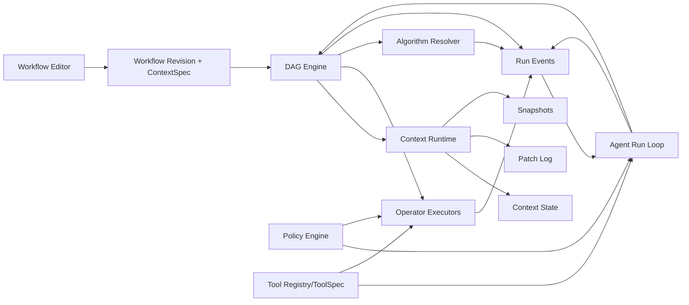

# GoyaVision 重构落地开发方案（上下文内核 + 算法库 + Agent 工程化）

最后更新：2026-02-08

## 1. 背景与目标

GoyaVision 当前已具备：
- 版本化算子体系（HTTP/CLI/MCP/AIModel）
- DAG 工作流执行引擎
- 任务追踪与产物体系
- 多租户与 RBAC 基础能力

但在平台可持续性上仍存在关键缺口：
- 工作流运行时缺少“统一上下文内核”，参数与节点输出传递依赖临时拼装
- 算子中心缺少“算法意图层”，无法形成可治理的算法资产
- Agent 仅具备执行基础，不具备工程化闭环（可描述、可控、可观测、可分类、可限制）

本方案目标：
1. 建立 **定义态 ContextSpec + 运行态 ContextState** 的统一上下文体系。
2. 在算子中心引入 **算法库（Algorithm Library）**，沉淀可发布可复用的算法资产。
3. 让 GoyaVision 具备 **工程化 Agent 能力**，优先落地 Run Loop 模式。

## 2. 范围与非范围

### 2.1 本期范围
- 工作流上下文重构（模型、存储、执行引擎、接口）
- 算法库领域建模与后端/前端入口
- Agent Runtime（Run Loop）基础设施落地
- 工具契约、执行策略、观测事件、错误分类、权限收敛

### 2.2 非范围（后续迭代）
- DAG 内 Decision Node（Agent 作为节点）
- 全量历史数据兼容迁移（当前开发阶段，直接重构）
- 多模型复杂编排优化器（先支持规则 + 基础策略）

## 3. 需求定义

### 3.1 统一上下文需求
1. 必须区分定义态与运行态：
   - ContextSpec：属于 WorkflowRevision，可版本化、可静态校验
   - ContextState：属于 TaskRun，可快照、可回放
2. 并发一致性硬规则：
   - 节点默认只能写 `nodes.<node_key>.*`
   - 写全局共享区必须是 `context_spec.shared_keys` 中声明项
   - 共享键必须定义 conflict policy 且启用 CAS
3. 存储策略：
   - Patch 为主、State 物化、Snapshot 辅助
   - 支持回放、审计、冲突定位

### 3.2 算法库需求
1. 算法资产分层：
   - Algorithm（意图层）
   - ImplementationBinding（能力层）
   - EvaluationProfile（评测证据层）
2. 支持多实现与选择策略：
   - 默认实现（稳定）
   - 高精度实现（慢/贵）
   - 低成本实现（快/省）
3. 工作流可直接引用算法版本并覆盖部分参数

### 3.3 Agent 工程化需求
围绕五件事落地：
1. 工具可描述：ToolSpec 统一契约
2. 执行可控：预算、超时、并发、重试、熔断
3. 观测可读：会话/步骤/工具调用事件化
4. 错误可分类：结构化 taxonomy + 默认恢复策略
5. 权限可限制：工具级授权 + 数据域限制 + 最小权限令牌

## 4. 目标架构



### 4.1 核心分层
- 领域层：新增上下文、算法、Agent 运行协议
- 应用层：新增上下文服务、算法发布服务、Agent 控制服务
- 基础设施层：新增 context 表、run_events、policy 执行器
- 接口层：新增 workflow revision/context API、算法库 API、agent API

## 5. 技术设计

## 5.1 数据模型设计

### 5.1.1 工作流定义态（Revision）
新增 `workflow_revisions`：
- `id`
- `workflow_id`
- `revision`
- `definition`（nodes/edges/trigger/context_spec）
- `status`（draft/active/archived）
- `created_at`

说明：Task 必须绑定 revision，保证回放语义稳定。

### 5.1.2 上下文运行态
新增三张表：

1. `task_context_state`（当前物化态）
- `task_id` (pk)
- `version` (bigint)
- `data` (jsonb)
- `updated_at`

2. `task_context_patches`（append-only）
- `id`
- `task_id`
- `writer_node_key`
- `before_version`
- `after_version`
- `diff` (jsonb)
- `created_at`

3. `task_context_snapshots`（可选 checkpoint）
- `id`
- `task_id`
- `version`
- `data` (jsonb)
- `trigger` (periodic|manual|key_node)
- `created_at`

### 5.1.3 算法库模型
新增：

1. `algorithms`
- `id/code/name/description/scenario/status/tags`

2. `algorithm_versions`
- `id/algorithm_id/version/status/default_impl`

3. `algorithm_implementations`
- `id/algorithm_version_id`
- `impl_type` (operator_version|mcp_tool|ai_chain)
- `binding_ref`
- `profile` (latency/cost/quality)
- `is_default`

4. `algorithm_evaluation_profiles`
- `id/algorithm_version_id`
- `dataset_ref`
- `metrics` (jsonb)
- `report_artifact_id`
- `summary`

### 5.1.4 Agent 运行模型
新增：

1. `agent_sessions`
- `id/task_id/status/budget/step_count/started_at/ended_at`

2. `run_events`
- `id/task_id/session_id/event_type/source/node_key/tool_name/payload/created_at`

3. `tool_policies`
- `id/tool_name/risk_level/permissions/data_access/determinism/limits`

## 5.2 领域模型设计

### 5.2.1 ContextSpec
```json
{
  "vars": {
    "video_language": {"type": "string", "required": false, "default": "zh", "readonly": false}
  },
  "shared_keys": {
    "shared.alerts": {"type": "array", "conflict_policy": "reject", "cas": true}
  }
}
```

### 5.2.2 NodeConfig（增强）
```json
{
  "params": {},
  "retry_count": 2,
  "timeout_seconds": 30,
  "input_mapping": {"image_url": "vars.input_image"},
  "output_mapping": {"nodes.detector.boxes": "results.0.data.boxes"}
}
```

### 5.2.3 ToolSpec（增强）
必填关键字段：
- name/description/input_schema/output_schema
- determinism: deterministic|stochastic
- data_access: read_scopes/write_scopes/network_allowlist
- timeout/retry/idempotent/risk_level/required_permissions

## 5.3 执行引擎设计

### 5.3.1 执行主流程
1. 读取 Task 绑定的 WorkflowRevision（含 ContextSpec）
2. 初始化 ContextState(version=1)
3. DAG 分层执行
4. 每节点：
   - 用 input_mapping 从 ContextState 解析输入
   - 执行 operator/tool
   - 产出 diff，做 CAS patch 提交
   - 写 run event
5. 完成后写 checkpoint snapshot

### 5.3.2 CAS 与冲突处理
- patch 提交条件：`before_version == current_version`
- 不满足触发 `ContextVersionConflict`
- 引擎重试读取最新 state 后再提交（有限次）
- 共享键按 conflict policy 生效

### 5.3.3 回放机制
- `snapshot(version<=target)` + `patches(after snapshot)`
- 依据 `workflow_revision_id` 保证解释一致

## 5.4 Agent Runtime 设计（Run Loop）

### 5.4.1 会话状态机
`Plan -> Act -> Observe -> Recover -> Finish`

### 5.4.2 默认恢复策略表
| category | retryable | backoff | fallback | require_human | severity |
|---|---|---|---|---|---|
| TRANSIENT | true | exponential | true | false | medium |
| TIMEOUT | true | exponential | true | false | medium |
| RESOURCE_LIMIT | true | linear+throttle | true | optional | high |
| VALIDATION | false | none | param_repair | true | medium |
| POLICY_DENY | false | none | false | true | high |
| DEPENDENCY | conditional | exponential | true | optional | high |
| TOOL_BUG | false | none | switch_impl | true | high |
| MODEL_REASONING | conditional | short_retry | switch_model | optional | medium |

### 5.4.3 结构化错误协议
所有执行器统一返回：
- `category`
- `root_cause`
- `action_hint`
- `retryable`
- `provider_code`

## 5.5 权限与安全设计

### 5.5.1 双层权限
1. API 权限（现有 RBAC 扩展）
2. Tool 权限（tool:invoke:<name>）

### 5.5.2 数据访问限制
- data_access 进入短期令牌 claim
- 执行器读取越界即 policy deny

### 5.5.3 高风险工具策略
- risk_level=high 默认需要审批或人工确认

## 5.6 观测设计

统一事件规范：
- `task_started/task_finished`
- `node_started/node_finished/node_failed`
- `context_patch_applied/context_conflict`
- `tool_called/tool_succeeded/tool_failed`
- `agent_decision/agent_action/agent_escalation`

事件最小字段：
- `trace_id/task_id/session_id/node_key/tool_name/timestamp/payload`

## 6. API 设计（关键增量）

### 6.1 工作流与上下文
- `POST /api/v1/workflows/:id/revisions`
- `GET /api/v1/workflows/:id/revisions/:rev`
- `GET /api/v1/tasks/:id/context`
- `GET /api/v1/tasks/:id/context/patches`
- `POST /api/v1/tasks/:id/context/snapshot`

### 6.2 算法库
- `GET /api/v1/algorithms`
- `POST /api/v1/algorithms`
- `POST /api/v1/algorithms/:id/versions`
- `POST /api/v1/algorithms/:id/versions/:ver/publish`
- `POST /api/v1/algorithms/:id/versions/:ver/implementations`
- `POST /api/v1/algorithms/:id/versions/:ver/evaluations`

### 6.3 Agent
- `GET /api/v1/agent/sessions`
- `POST /api/v1/agent/sessions`
- `GET /api/v1/agent/sessions/:id`
- `GET /api/v1/agent/sessions/:id/events`
- `POST /api/v1/agent/sessions/:id/run`
- `POST /api/v1/agent/sessions/:id/stop`
- `GET /api/v1/tasks/:id/events`

## 7. 前端改造要点

1. 工作流编辑器新增 ContextSpec 配置面板
2. NodeInspector 新增 input/output mapping 可视化配置
3. 算子中心新增“算法库”子菜单与页面
4. 任务详情新增上下文版本与 patch 时间线
5. Agent 会话页展示决策链与工具调用轨迹

## 8. 分阶段实施计划

### 阶段 R1（上下文内核）
- Workflow 定义增加 ContextSpec
- Task 运行增加 State/Patch/Snapshot
- DAG 引擎接入 Context 读写与 CAS

### 阶段 R2（算法库）
- 算法实体、版本、实现绑定
- EvaluationProfile 与报告关联
- 工作流节点支持 algorithm_ref

### 阶段 R3（Agent Run Loop）
- ToolSpec Registry
- Session 状态机
- 错误分类与恢复策略
- run_events 全链路

### 阶段 R4（治理增强）
- 工具级权限与审批闸门
- 策略热更新
- 审计报表与回放工具

## 9. 验收标准

1. 上下文一致性
- 并发执行下无隐式覆盖
- patch 可追溯
- 指定任务可回放到任意版本点

2. 算法资产化
- 至少 2 个业务算法完成“发布 + 多实现 + 评测证据”
- 工作流可直接引用算法版本

3. Agent 工程化
- 每次会话具备完整事件链
- 结构化错误分类覆盖率 >= 95%
- 非授权工具调用拦截率 = 100%

4. 平台稳定性
- 核心执行链路无 P0/P1 回归
- 关键 API 在标准负载下满足现有 SLA

## 10. 风险与对策

1. 风险：上下文并发写放大
- 对策：CAS + 有限重试 + 共享键白名单

2. 风险：Agent 行为不可控
- 对策：预算上限 + policy deny by default + 人工升级

3. 风险：算法库与现有模板体系割裂
- 对策：复用 OperatorTemplate 和版本体系，算法仅做意图编排层

4. 风险：观测数据量增长
- 对策：事件分级、冷热分层存储、归档策略

## 11. 本轮重构起步（已执行策略）

本轮代码重构已落地 R1，并启动 R2/R3 基础骨架：
- 引入 ContextSpec / ContextState 领域模型
- 引入 task_context_state/task_context_patches/task_context_snapshots 存储模型
- DAG 引擎接入上下文初始化与 patch 写入闭环
- API 与 DTO 增量支持 ContextSpec
- 新增算法库领域模型（Algorithm/Version/Implementation/EvaluationProfile）与仓储实现
- 新增算法库 API（列表/详情/创建/更新/删除/版本创建/版本发布）
- 新增 Agent 工程化基础模型（ToolSpec determinism + data_access、ToolPolicy、Session、RunEvent）
- DAG 引擎新增 run_events 写入（node_started/node_succeeded/node_failed）
- 新增任务上下文 API（读取 context、读取 patch 列表、手动创建 snapshot）
- 新增 Agent 会话 API（创建会话、查询会话、停止会话）
- 新增 Agent Run Step API（会话驱动重试恢复，支持 `max_actions`）
- 新增任务事件 API（按 task 查询 run_events）
- 前端新增算法库页面骨架（列表、创建/编辑、版本创建与发布）
- 前端任务详情新增运行上下文/patch/event 可视化弹窗
- 前端新增 Agent 会话专页（会话列表、手动 Run Step、恢复链路时间线）
- Agent 会话链路支持跨 task 聚合 DAG 事件视图（自动关联重试任务链）

## 12. 当前完成度与剩余项（2026-02-08）

### 已完成
- R1：上下文运行态模型、CAS patch、执行链路接入、上下文 API
- Workflow Revision 机制：`workflow_revisions` 模型、仓储、创建/更新自动产出 revision、Task 绑定 revision、执行按 revision 解析
- Workflow Revision API：`POST /workflows/:id/revisions`、`GET /workflows/:id/revisions`、`GET /workflows/:id/revisions/:revision`
- R2：算法库核心数据模型、仓储、后端 API 与前端 API 客户端
- R3（核心）：Agent Session/RunEvent/ToolPolicy 数据模型、会话 API、Run Step 执行闭环（`Plan->Observe->Recover->Act->Finish`）、错误分类与默认恢复策略
- 工作流节点算法绑定：`node.config.algorithm_ref` 已支持，运行时可按策略解析算法实现并执行
- ToolPolicy 强制拦截：禁用工具拒绝执行；高风险需 `policy_approved=true`；权限与 `data_access` 超范围请求会被拒绝

### 剩余关键项
- 当前无阻断型剩余项（核心重构链路已闭环）
- 可选增强：Agent 会话链路支持按节点/阶段聚合统计与导出
